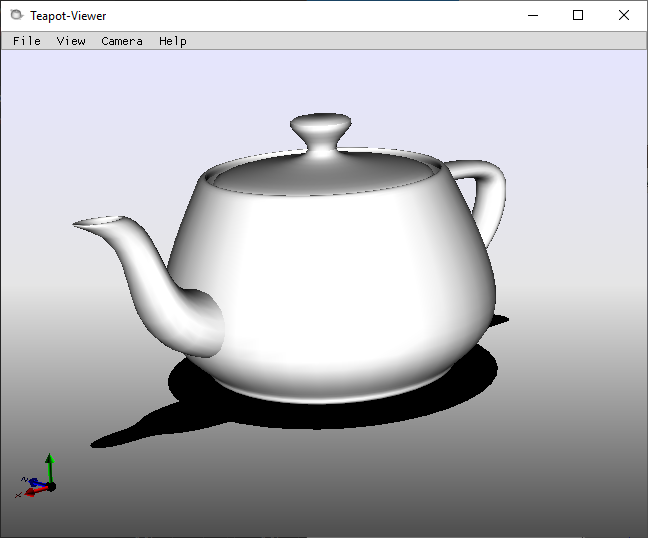
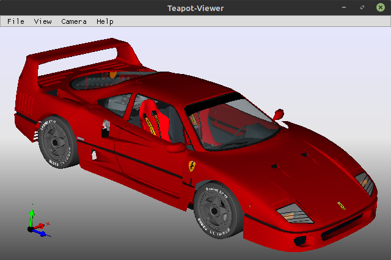
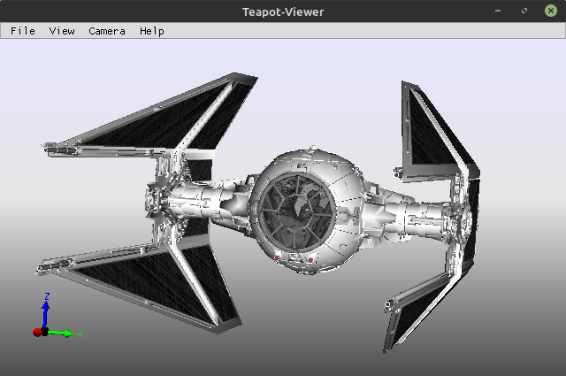
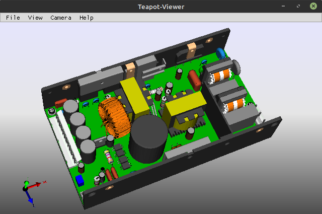

### Teapot-Viewer 1.0b


Teapot-Viewer is a fast and extendable 3D-Model Viewer for Linux and Windows.

The GUI is written in GoLang and is based on [ImGui](https://github.com/ocornut/imgui). The core/scenegraph is written in C++ using common design pattens (graph,visitor). For rendering there s an graphics API independent renderer interface. 

<!--
Currently there is a basic Direct3D 9 and a OpenGL 1.4 renderer implementation.

* The Direct3D 9 renderer runs a simple shader, supporting bumpmapping, reflectiontexture and alphatextures.
* The OpenGL renderer uses the fixed pipeline, the textures are loaded with devIL (http://openil.sourceforge.net).
* -->

The SceneIO Module, provides an internal OBJ reader/writer. Additionally there is a simple plugin interface. It is possible to load Models from zip files.

Currently there are several importer plugins, all are based on 3rd-party libraries:

* Assimp (.dae and more) (https://github.com/assimp/assimp/blob/master/Readme.md)
* lib3DS (.3ds) (http://code.google.com/p/lib3ds/)
* OpenCascade (.stp, .iges, .brep) (http://www.opencascade.org/)
* SketchUpSDK (.skp) (http://code.google.com/apis/sketchup/)
* Coin3d (.iv, .wrl) (http://www.coin3d.org)
* libG3D (.q3d and more) (http://automagically.de/g3dviewer/) '>
* <strike>FCollada (.dae) (http://www.feelingsoftware.com/)</strike>

##### Screenshots:

   

## Build:

* Windows (mingw):
````
pacman -S mingw-w64-x86_64-assimp mingw-w64-x86_64-oce mingw-w64-x86_64-coin
go build -x -ldflags=all='-H windowsgui -s -w' -tags oce coin -o ./bin/teapot-viewer.exe
````

* Linux:
````
sudo apt-get install -y mesa-utils mesa-common-dev libsdl2-dev libglfw3-dev
sudo apt-get install -y libgtk-3-dev libcairo2-dev libpango1.0-dev
sudo apt-get install -y libassimp-dev libcoin80-dev liboce-ocaf-dev
go build -x -ldflags=all='-s -w' -tags oce coin -o ./bin/teapot-viewer
````